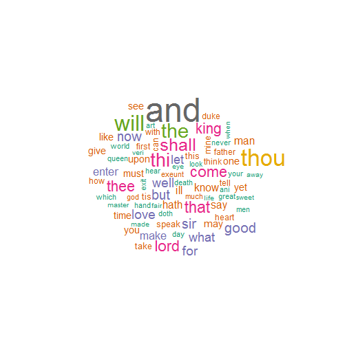

Lightning talk on text mining Package (tm) in R
========================================================
author:  Ravi Taneja
date:  06-26-2018
autosize: true

Some Basic Concepts
========================================================

-- Corpus : The basic structure in **tm** for managing documents, it represents a collection of text documents.

-- Corpora : Plural for Corpora

-- Stemming : Stemming usually refers to a crude heuristic process that chops off the ends of words in the hope of achieving this goal correctly most of the time, and often includes the removal of derivational affixes.
e.g. reducing derived words like **says**, **said** into **say**

-- Lemmatization : refers to doing things properly with the use of a vocabulary and morphological analysis of words, normally aiming to remove inflectional endings only and to return the base or dictionary form of a word, which is known as the lemma

e.g. If the token is **saw**, lemmatization would attempt to return either **see** or **saw** depending on whether the use of the token was as a verb or a noun

Loading required packages and text into the Corpus
========================================================


```r
library(tm)
library(SnowballC)
library(wordcloud)
# tm package provides 3 predefined set of text sources: DirSource, VectorSource, DataframeSource
shakespeare <- VCorpus(DirSource("tm_data", encoding = "UTF-8"))

## Writing the Corpus files to the hard disk
writeCorpus(shakespeare)
```

Inspecting the Corpus "Shakespeare"
========================================================


```r
#Meta data of the Corpus
summary(shakespeare)
```

```
      Length Class             Mode
1.txt 2      PlainTextDocument list
2.txt 2      PlainTextDocument list
3.txt 2      PlainTextDocument list
```

```r
# Meta data of each document 
meta(shakespeare[[1]])
```

```
  author       : character(0)
  datetimestamp: 2018-06-26 23:29:33
  description  : character(0)
  heading      : character(0)
  id           : 1.txt
  language     : en
  origin       : character(0)
```

Inspecting the Corpus "Shakespeare"
========================================================


```r
# Inspect the documents
inspect(shakespeare[1:2])
```

```
<<VCorpus>>
Metadata:  corpus specific: 0, document level (indexed): 0
Content:  documents: 2

[[1]]
<<PlainTextDocument>>
Metadata:  7
Content:  chars: 2140195

[[2]]
<<PlainTextDocument>>
Metadata:  7
Content:  chars: 2139891
```

Corpus transformations: Removing white Spaces
========================================================

```r
# Removing white Spaces
shakespeare <- tm_map(shakespeare, stripWhitespace, lazy=FALSE)
writeLines(as.character(shakespeare[[1]])[200:250])
```

```
 When forty winters shall besiege thy brow,
 And dig deep trenches in thy beauty's field,
 Thy youth's proud livery so gazed on now,
 Will be a tattered weed of small worth held:
 Then being asked, where all thy beauty lies,
 Where all the treasure of thy lusty days;
 To say within thine own deep sunken eyes,
 Were an all-eating shame, and thriftless praise.
 How much more praise deserved thy beauty's use,
 If thou couldst answer 'This fair child of mine
 Shall sum my count, and make my old excuse'
 Proving his beauty by succession thine.
 This were to be new made when thou art old,
 And see thy blood warm when thou feel'st it cold.


 3
 Look in thy glass and tell the face thou viewest,
 Now is the time that face should form another,
 Whose fresh repair if now thou not renewest,
 Thou dost beguile the world, unbless some mother.
 For where is she so fair whose uneared womb
 Disdains the tillage of thy husbandry?
 Or who is he so fond will be the tomb,
 Of his self-love to stop posterity?
 Thou art thy mother's glass and she in thee
 Calls back the lovely April of her prime,
 So thou through windows of thine age shalt see,
 Despite of wrinkles this thy golden time.
 But if thou live remembered not to be,
 Die single and thine image dies with thee.


 4
 Unthrifty loveliness why dost thou spend,
 Upon thy self thy beauty's legacy?
 Nature's bequest gives nothing but doth lend,
 And being frank she lends to those are free:
 Then beauteous niggard why dost thou abuse,
 The bounteous largess given thee to give?
 Profitless usurer why dost thou use
 So great a sum of sums yet canst not live?
 For having traffic with thy self alone,
 Thou of thy self thy sweet self dost deceive,
 Then how when nature calls thee to be gone,
 What acceptable audit canst thou leave?
 Thy unused beauty must be tombed with thee,
 Which used lives th' executor to be.


 5
```

Corpus transformations: Stemming
========================================================

```r
options(width = 400)
# Stemming 
shakespeare <- tm_map(shakespeare, stemDocument, lazy=FALSE)
writeLines(as.character(shakespeare[[1]])[200:250])
```

```
When forti winter shall besieg thi brow,
And dig deep trench in thi beauti field,
Thi youth proud liveri so gaze on now,
Will be a tatter weed of small worth held:
Then be asked, where all thi beauti lies,
Where all the treasur of thi lusti days;
To say within thine own deep sunken eyes,
Were an all-eat shame, and thriftless praise.
How much more prais deserv thi beauti use,
If thou couldst answer This fair child of mine
Shall sum my count, and make my old excus
Prove his beauti by success thine.
This were to be new made when thou art old,
And see thi blood warm when thou feel'st it cold.


3
Look in thi glass and tell the face thou viewest,
Now is the time that face should form another,
Whose fresh repair if now thou not renewest,
Thou dost beguil the world, unbless some mother.
For where is she so fair whose unear womb
Disdain the tillag of thi husbandry?
Or who is he so fond will be the tomb,
Of his self-lov to stop posterity?
Thou art thi mother glass and she in thee
Call back the love April of her prime,
So thou through window of thine age shalt see,
Despit of wrinkl this thi golden time.
But if thou live rememb not to be,
Die singl and thine imag die with thee.


4
Unthrifti loveli whi dost thou spend,
Upon thi self thi beauti legacy?
Natur bequest give noth but doth lend,
And be frank she lend to those are free:
Then beauteous niggard whi dost thou abuse,
The bounteous largess given thee to give?
Profitless usur whi dost thou use
So great a sum of sum yet canst not live?
For have traffic with thi self alone,
Thou of thi self thi sweet self dost deceive,
Then how when natur call thee to be gone,
What accept audit canst thou leave?
Thi unus beauti must be tomb with thee,
Which use live th executor to be.


5
```

Corpus transformations: Remove punctuation
========================================================

```r
# Removing punctuation
shakespeare <- tm_map(shakespeare, removePunctuation, lazy=FALSE)
writeLines(as.character(shakespeare[[1]])[200:250])
```

```
When forti winter shall besieg thi brow
And dig deep trench in thi beauti field
Thi youth proud liveri so gaze on now
Will be a tatter weed of small worth held
Then be asked where all thi beauti lies
Where all the treasur of thi lusti days
To say within thine own deep sunken eyes
Were an alleat shame and thriftless praise
How much more prais deserv thi beauti use
If thou couldst answer This fair child of mine
Shall sum my count and make my old excus
Prove his beauti by success thine
This were to be new made when thou art old
And see thi blood warm when thou feelst it cold


3
Look in thi glass and tell the face thou viewest
Now is the time that face should form another
Whose fresh repair if now thou not renewest
Thou dost beguil the world unbless some mother
For where is she so fair whose unear womb
Disdain the tillag of thi husbandry
Or who is he so fond will be the tomb
Of his selflov to stop posterity
Thou art thi mother glass and she in thee
Call back the love April of her prime
So thou through window of thine age shalt see
Despit of wrinkl this thi golden time
But if thou live rememb not to be
Die singl and thine imag die with thee


4
Unthrifti loveli whi dost thou spend
Upon thi self thi beauti legacy
Natur bequest give noth but doth lend
And be frank she lend to those are free
Then beauteous niggard whi dost thou abuse
The bounteous largess given thee to give
Profitless usur whi dost thou use
So great a sum of sum yet canst not live
For have traffic with thi self alone
Thou of thi self thi sweet self dost deceive
Then how when natur call thee to be gone
What accept audit canst thou leave
Thi unus beauti must be tomb with thee
Which use live th executor to be


5
```

Corpus transformations: Remove stopwords
========================================================

```r
# Remove stopwords
shakespeare <- tm_map(shakespeare, content_transformer(removeWords), stopwords("english"), lazy=FALSE)
writeLines(as.character(shakespeare[[1]])[200:250])
```

```
When forti winter shall besieg thi brow
And dig deep trench  thi beauti field
Thi youth proud liveri  gaze  now
Will   tatter weed  small worth held
Then  asked   thi beauti lies
Where   treasur  thi lusti days
To say within thine  deep sunken eyes
Were  alleat shame  thriftless praise
How much  prais deserv thi beauti use
If thou couldst answer This fair child  mine
Shall sum  count  make  old excus
Prove  beauti  success thine
This    new made  thou art old
And see thi blood warm  thou feelst  cold


3
Look  thi glass  tell  face thou viewest
Now   time  face  form another
Whose fresh repair  now thou  renewest
Thou dost beguil  world unbless  mother
For     fair whose unear womb
Disdain  tillag  thi husbandry
Or     fond will   tomb
Of  selflov  stop posterity
Thou art thi mother glass    thee
Call back  love April   prime
So thou  window  thine age shalt see
Despit  wrinkl  thi golden time
But  thou live rememb   
Die singl  thine imag die  thee


4
Unthrifti loveli whi dost thou spend
Upon thi self thi beauti legacy
Natur bequest give noth  doth lend
And  frank  lend    free
Then beauteous niggard whi dost thou abuse
The bounteous largess given thee  give
Profitless usur whi dost thou use
So great  sum  sum yet canst  live
For  traffic  thi self alone
Thou  thi self thi sweet self dost deceive
Then   natur call thee   gone
What accept audit canst thou leave
Thi unus beauti must  tomb  thee
Which use live th executor  


5
```

Corpus transformations: Convert to lowercase
========================================================

```r
# Remove stopwords
shakespeare <- tm_map(shakespeare, content_transformer(tolower), lazy = FALSE)
writeLines(as.character(shakespeare[[1]])[200:250])
```

```
when forti winter shall besieg thi brow
and dig deep trench  thi beauti field
thi youth proud liveri  gaze  now
will   tatter weed  small worth held
then  asked   thi beauti lies
where   treasur  thi lusti days
to say within thine  deep sunken eyes
were  alleat shame  thriftless praise
how much  prais deserv thi beauti use
if thou couldst answer this fair child  mine
shall sum  count  make  old excus
prove  beauti  success thine
this    new made  thou art old
and see thi blood warm  thou feelst  cold


3
look  thi glass  tell  face thou viewest
now   time  face  form another
whose fresh repair  now thou  renewest
thou dost beguil  world unbless  mother
for     fair whose unear womb
disdain  tillag  thi husbandry
or     fond will   tomb
of  selflov  stop posterity
thou art thi mother glass    thee
call back  love april   prime
so thou  window  thine age shalt see
despit  wrinkl  thi golden time
but  thou live rememb   
die singl  thine imag die  thee


4
unthrifti loveli whi dost thou spend
upon thi self thi beauti legacy
natur bequest give noth  doth lend
and  frank  lend    free
then beauteous niggard whi dost thou abuse
the bounteous largess given thee  give
profitless usur whi dost thou use
so great  sum  sum yet canst  live
for  traffic  thi self alone
thou  thi self thi sweet self dost deceive
then   natur call thee   gone
what accept audit canst thou leave
thi unus beauti must  tomb  thee
which use live th executor  


5
```

Term-Document Matrices
========================================================

```r
# Many algorithms in NLP operate on word frequency table and we call it document-term matrix. 
# In tm package we either TermDocumentMatrix or DocumentTermMatrix and it employs sparse matrices for Corpora
dtm <- DocumentTermMatrix(shakespeare)
inspect(dtm)
```

```
<<DocumentTermMatrix (documents: 3, terms: 26278)>>
Non-/sparse entries: 44424/34410
Sparsity           : 44%
Maximal term length: 33
Weighting          : term frequency (tf)
Sample             :
       Terms
Docs     and come lord shall that  the thee  thi thou will
  1.txt 3388 1146 1393  1454 1271 1916 1298 1746 2274 1950
  2.txt 3184 1331 1181  1499 1313 1711 1140 1392 2014 2150
  3.txt 1558  645  599   645  623  760  740  893 1198  955
```

Term-Document Matrices: Operations
========================================================

```r
# Find terms that occur at least five times 

highFreqTerms <- findFreqTerms(dtm, 25, )
summary(highFreqTerms)
```

```
   Length     Class      Mode 
     2843 character character 
```

Term-Document Matrices: Top 20 terms
========================================================

```r
# Find terms that occur at least five times 

highFreqTerms[1:15]
```

```
 [1] "19901993" "aaron"    "abbess"   "abhor"    "abid"     "abl"      "aboard"   "about"    "abov"     "abroad"   "absenc"   "absent"   "absolut"  "abus"     "abusd"   
```

Visualization - Word Cloud with words of Frequency higher than 1500
========================================================



References:
========================================================
1. https://nlp.stanford.edu/IR-book/html/htmledition/contents-1.html

2. http://angerhang.github.io/statsWithR/tutorials/textMiningIntro.html

3. https://cran.r-project.org/web/packages/tm/vignettes/tm.pdf

4. https://rstudio-pubs-static.s3.amazonaws.com/265713_cbef910aee7642dc8b62996e38d2825d.html

5. https://eight2late.wordpress.com/2015/05/27/a-gentle-introduction-to-text-mining-using-r/


